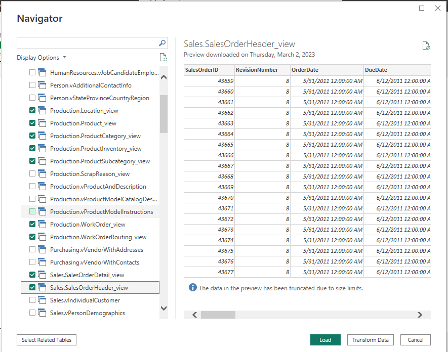
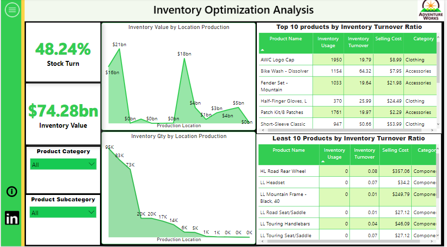

# Inventory-Management-Analysis
This is an Analysis to optimise inventory management for **FitCapacity** company by analyzing sales and inventory data using SQL and PowerBI.

---

## Introduction:
This is an Inventory Management analysis done with SQL and PowerBI, I analyzed Inventory data, production data and Sales data from the AdventureWorks 2019 database. It is a fictitious company named "FitCapacity" and it is intended to solve some problems.

**_Disclaimer_** This is not a real company as we know that adventure works database is compiled by Microsoft for learning purposes.

---
## Problem Statement:

The goal of the analysis is to:
- identify which products have the highest turnover rate and which have the lowest turnover rate.
- identify the average time a product is out of stock and the frequency of stockouts.
- classify products into high-selling, low-selling and average-selling. 
- use the insights gained to make recommendations for how to optimize inventory levels and minimize stockouts which may include adjustments to reorder points, ordering certain products, or discontinuing products that are not selling well.
 ----
 
 ## Skills and Concepts demonstrated:
 
 - SQL (Select, alias, Views)
 - PowerBI concepts like:
   - creating columns for calculations for dates, time, and duration
   - Creating key performance indicators (KPIs) and other business calculations,
   - Developing general DAX calculations that deal with text and numbers,
   - Performed advanced DAX calculations for solving statistical measures and other mathematical formulas
   - Data Modelling,
   - Measures,
   - Navigation panes,
   - filters,
   - tooltips, 
   - buttons,
   - bookmarks,
   - Data Visualization
 ---
  
 ## Data Source:

The data used for this work is obtained from the AdventureWorks 2019 database 2019. I studied the Schema, Objects related to the Schema, data dictionary and found the right tables for the analysis. 

  - You can find a link to get started with installation and restoration of the database to your local machine.  [here:](https://youtu.be/VpY0Q_kwtIw) 
 ---
 
## Data Transformation:
- Several structured queries were written to get the right tables and then saved as views in the Database on SQL Management Studio.

- Then I imported the views into my PowerBI desktop app 

- Then I selected the right views I had created in SQL. From here, we know the right tables from AdventureWorks to use.

- I transformed the data in Power Query, checked for Colum quality, consistent or appropriate data types
- I began writing several Dax and creating measures and calculated columns to get the right metrics for the Inventory analysis.
- I also created the calendar table
- The queries I wrote on SQL are  compiled and also uploaded here in this repository as "Inventory Management Scripts"
---

## Data Modelling:
The intelligence in PowerBI makes it such that tables are automatically joined by creating relationships with them. However, as someone who understands the dataset and wants to get specific insights and information. I had to create other relationships and measures to enable me. so I did another model. I created 7 dimension tables and 2 fact tables as I hoped for a Star Schema.

Created Model               |        Automated Model
:------------------------:  | :----------------------------------:
         | 

---
## Data Analysis

Several expressions and functions were made to arrive at the desired KPI or Metrics.  I would list a few:

-  Cost of Goods Sold = SUM( 'Production Product_view'[StandardCost]) * SUM('Sales SalesOrderDetail_view'[OrderQty])
-  CycleTime = SUM( 'Production WorkOrderRouting_view'[ActualResourceHrs] ) / SUM ( 'Production WorkOrder_view'[OrderQty])
- OnTimeProductionPercent = 
  VAR Num_0 = COUNTROWS(FILTER('Production WorkOrderRouting_view', 'Production WorkOrderRouting_view'[OnTime] = 0))
  VAR Num_1 = COUNTROWS(FILTER('Production WorkOrderRouting_view', 'Production WorkOrderRouting_view'[OnTime] = 1))
  RETURN 
  Num_1/(Num_0+Num_1)
- Stock Turn = [COGS]/[CostofInventory]
- ABC Ranking and XYZ analysis was also done.

_All the formlulas for the calculated columns and measures can not be well explained by just writing the expressions here as they are written on various tables. Kindly pardon me_   :smile:

## Data Visualization
The report consists of 4 pages
- The Inventory Page
- The Product Page
- The Sales Page
- insight Page

The report can be interacted with on the PowerBI service [here:](https://app.powerbi.com/view?r=eyJrIjoiNDI0YmQwYjItODQ2MC00YzAyLTlkMjgtMTMxZjExMzA0NzU1IiwidCI6IjM0ODhhMWU5LTQwNmYtNGMzNS04Yjc0LTkyOGUzNDM5Yzc1MCJ9)

## Features of the Report

The hamburger icon is a button that helps you to view the different pages. When you hover on it, you will see an effect and a click on it will open up a navigation pane that has buttons to direct you to the desired page you want to see. After which you can always return to the hamburger button when done. 
To get the insight, you click on the **black info icon** which will lead you to the insight page.
The LinkedIn icon functions very well too as a click on it will take you to my LinkedIn profile if you wish to contact me. I think you should. so i know how you feel about this project :grinning:

Here are the reports:

Inventory Page

Product Page

Sales Page

Insight Page

## Analysis
- The Company has 14 location for production/storage
- There are 4 main categories of products (Bikes, Accessories, Clothing and Components)
- The value of goods in the warehouse is about 74 billion USD
- Bike sales has the highest impact on Inventory and Sales followed by Accessories.
- There is a 42%  Stock turn ratio
- On time Production is 48%
- 93% of the entire products needs to be replaced for sales.

## Insights and Recommendation

- The 42%  Stock turn ratio which shows that sales are slow and there are stockpiled goods which have remained unsold. Efforts should be made to optimize production according to demand thereby increasing stock turn rate and better industry performance.

- For the 48% in on time production. As demand increases production capacity should be increased by utilizing time, labour and materials in the production process. An increase in on time production will lead to a faster production and sales delivery.

- Pareto principle for inventory which is an 80/20 rule that states that 80% of profit should come from 20% of the inventory was operational. With the ABC XYZ analysis, we identified certain products as: -AZ goods (High Value and uncertain demand) had the highest impact on Annual revenue, this group of goods should be  carefully catered for with effective measures put in place to manage their production, sales and delivery in order to minimize low stock level.-BZ goods (Medium value goods with uncertain demand) should also be monitored on regular basis as they also contribute to the annual revenue. -CZ goods(low value with uncertain demand) should be monitored periodically.

- 26.5% of goods are below Re-order point and 72.8% is below Safety Stock, just only about 0.73% are in stock. Little wonder there are about 93% of entire products that needs to be made available for sales. 

- Goods in the Subassembly location has the highest inventory value and quantity followed by those in the Miscellaneous storage location.

- The trends in demands and sales over the period shows a seasonality even the forecast also shows this. To further improve sales especially in seasons, complementary goods can be sold in bundles to optimize inventory in compliance to the ABC analysis.

- Annual Revenue also increased over the year of production although there are also evidences of various seasons in the sales.

- Overall, following up and adhering to the Safety Stocks and Re order points are necessary to meet up unexpected demands or supply disruptions. On -time production should be increase and regular inventory audits be carried out to ensure optimum inventory levels and reduced risk of overstocking or stockouts.

---
## Limitation

You know this project is such that i do not have access to the employers else i would have asked several questions relating to the data and made more analysis like on the Production.Product table there is a column named "Size". The inputs there are not consistent like we have letters, numbers all mixed up together. Since i did not know the intended pattern for classifying the sizes, I couldn't clean the data and did not use the data for this analysis.

